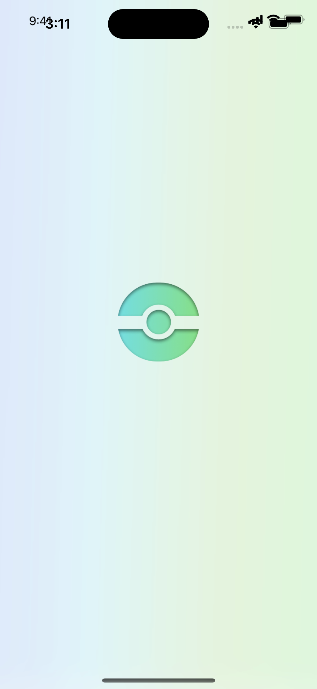
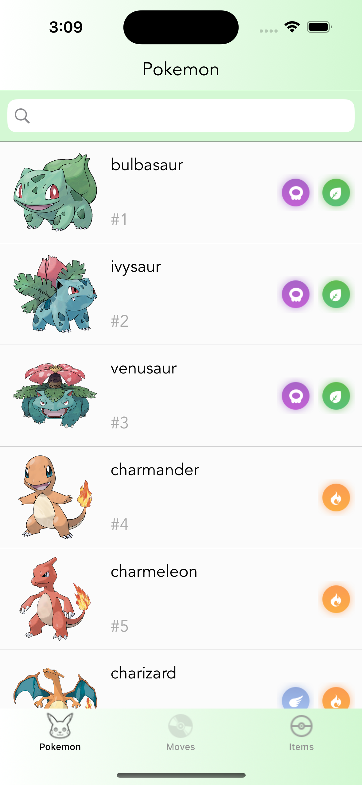
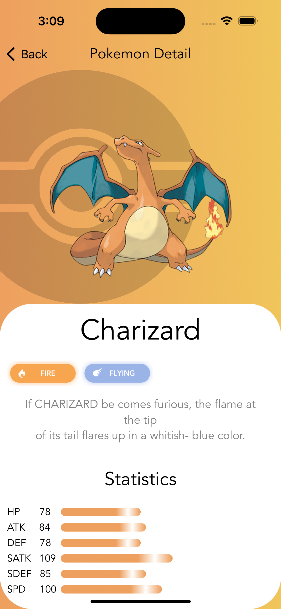
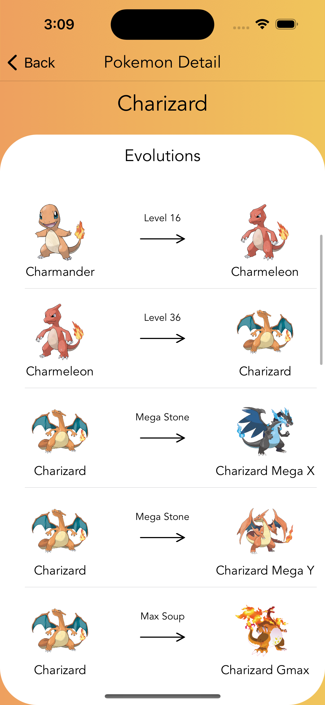
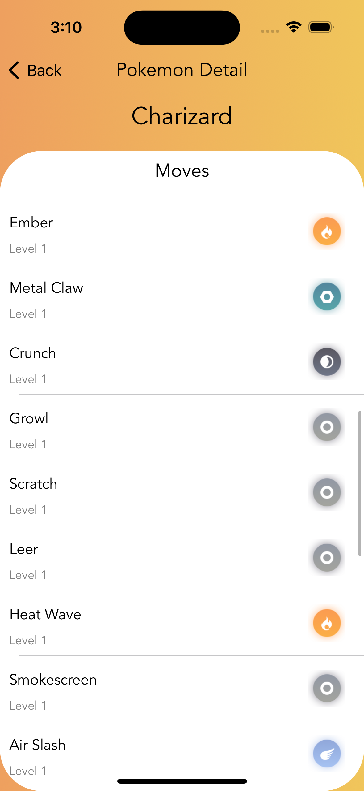
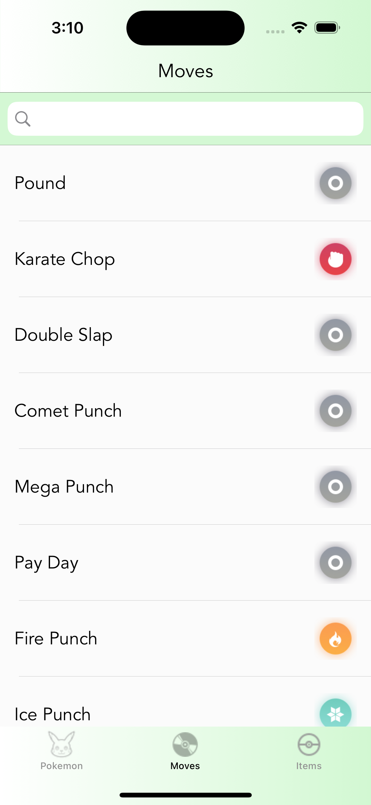
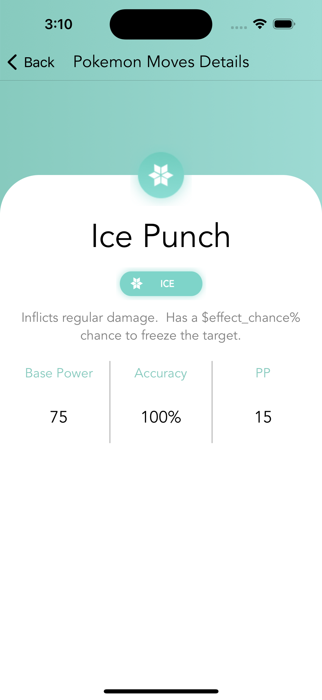
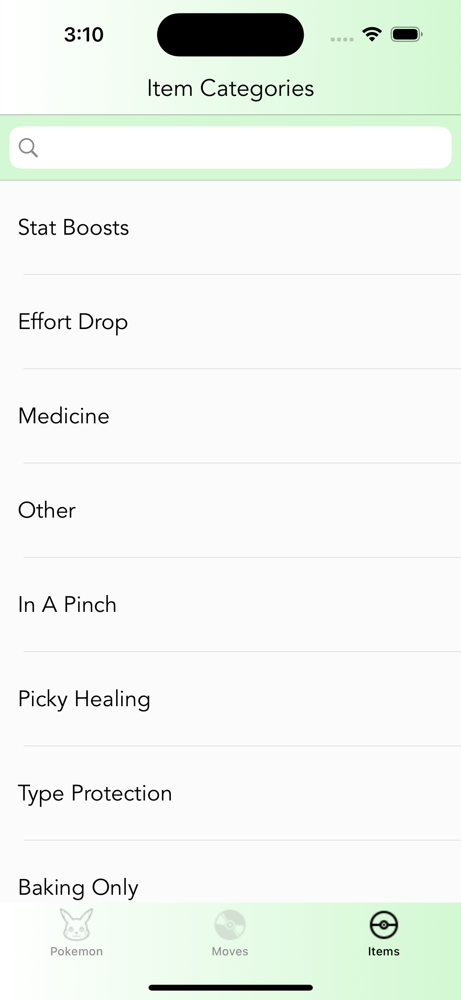
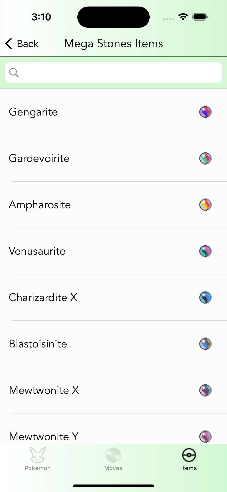
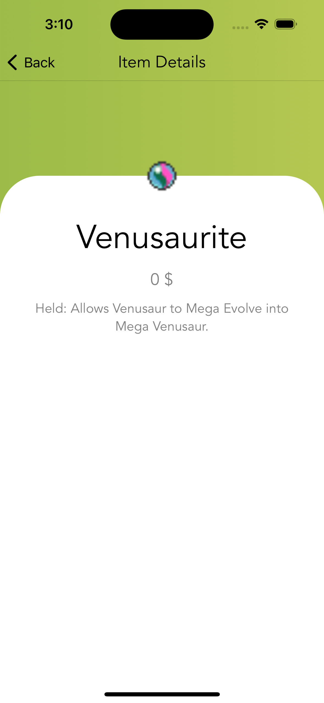

# PokemonViper

Pokemon is an iOS application that interacts with the Pokemon API.

# ScreenShot

  
  
  
  
  
  
  
  
  
  

# Features
- List of Pokemon sorted by number and filtered by region.
- Search Pokemon by region.
- Detail of every Pokemon and its complete evolution chain.
- Save your favorite Pokemon (add, remove or empty list).

# Architecture
- VIPER
- SOLID

# 3rd party libraries

- Kingfisher
- Alamofire

# Requirements
- iOS 14.0+
- Swift 5.0+

